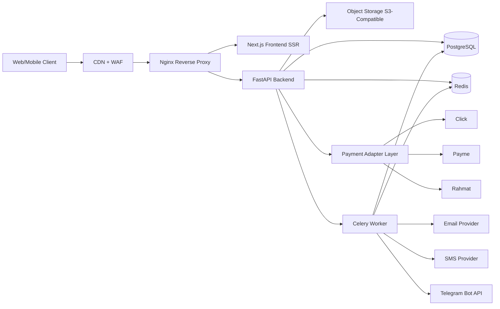
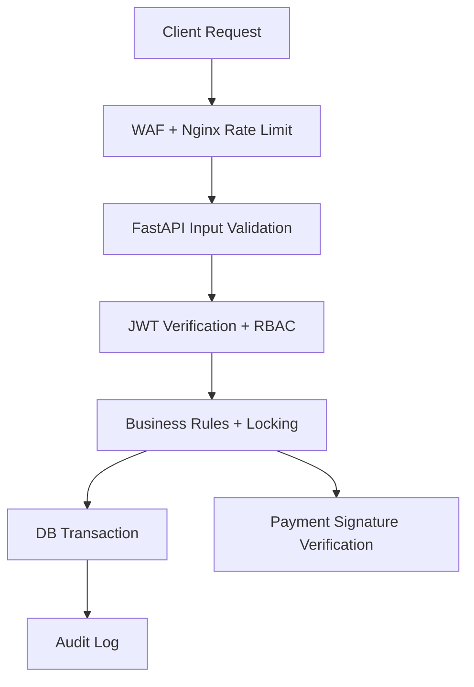

# Premium House Architecture (Production Blueprint)

## 1. System Overview

Premium House is a rental-only marketplace for apartments, houses, and villas. The architecture is service-oriented and optimized for:

- high booking concurrency without double booking
- secure online payments (Click/Payme/Rahmat ready)
- SEO-first public marketplace for Uzbekistan users
- horizontal scaling and operational observability

## 2. High-Level Architecture

## 3. Core Components

1. **Next.js Frontend (SSR)**
- SEO-friendly listing pages and location routes (`/tashkent`, `/samarkand` etc.)
- Customer, Host, Admin dashboards
- Server-side rendering for faster initial load and better indexing

2. **FastAPI Backend**
- JWT access + refresh token auth
- RBAC authorization for `SuperAdmin`, `Admin`, `Host`, `Customer`
- Booking, pricing, payment, commission, review, and admin analytics domains
- OpenAPI-first contract for web/mobile clients

3. **PostgreSQL**
- normalized relational schema with foreign keys
- strict booking overlap prevention via exclusion constraints
- auditing, soft delete, and transaction integrity

4. **Redis**
- distributed booking lock (`property + date range`)
- OTP caching and short-lived session data
- response caching for search pages and amenities
- rate limiting counters

5. **Celery / Background Workers**
- payment callback retries
- notification fan-out (email/SMS/Telegram)
- payout/commission reconciliation jobs
- analytics aggregation jobs

6. **Object Storage + CDN**
- property images stored in S3-compatible bucket (e.g., MinIO/AWS S3)
- CDN edge delivery for image optimization and low latency

7. **Payment Adapter Layer**
- provider-specific signing and webhook verification
- unified internal payment states
- idempotent capture/refund processing

## 4. Uzbekistan Market Readiness

- default currency: **UZS**
- default timezone: **Asia/Tashkent**
- phone-first auth + OTP suitable for local user behavior
- provider adapters designed for **Click**, **Payme**, **Rahmat**
- multilingual content fields recommended (`uz`, `ru`, `en`)

## 5. Security Architecture

Security controls:

- strict Pydantic validation at API boundary
- SQL injection prevention via SQLAlchemy parameterized queries
- XSS mitigation by output encoding and CSP headers on frontend
- webhook signature verification for payment callbacks
- Redis lock + PostgreSQL exclusion constraint for booking safety
- idempotency keys for booking/payment confirmation
- encrypted secrets in runtime (not in git)

## 6. Scalability Model

- stateless API + frontend containers for horizontal scaling
- Redis and PostgreSQL as shared state backends
- background workers scaled independently (`worker replicas`)
- read-heavy endpoints cacheable (property search/details)
- object storage offloads media from application nodes

## 7. Operational Observability

Recommended stack:

- structured JSON logs (`request_id`, `user_id`, `booking_id`)
- metrics: Prometheus + Grafana
- error tracking: Sentry
- uptime probes for API/frontend/payment callback endpoints
- alerts: payment callback failures, lock contention spikes, DB slow queries
