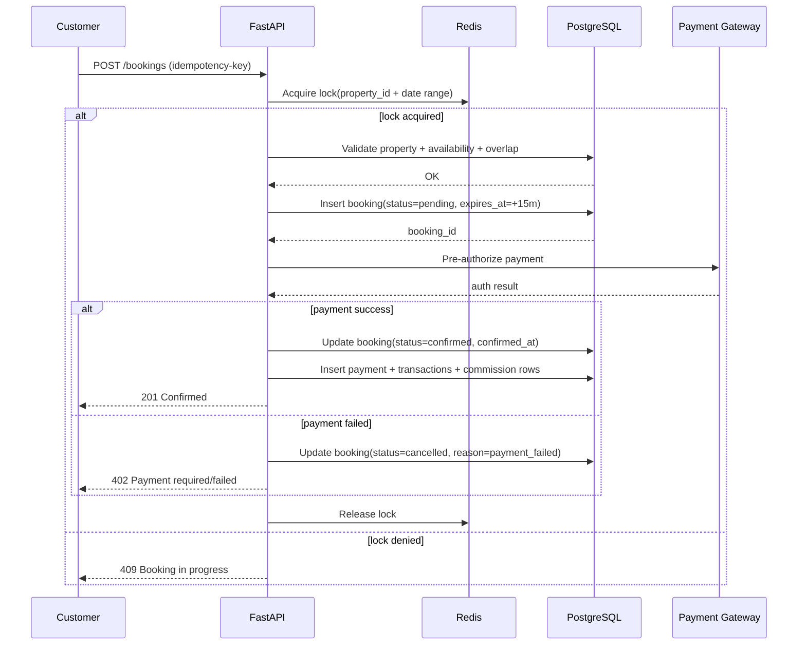

# Booking Flow Logic (Concurrency-Safe)

## 1. Booking State Machine

`pending -> confirmed -> completed`

`pending -> cancelled`

`confirmed -> cancelled` (policy/exception based)

## 2. Critical Rules

- `check_out > check_in`
- booking date ranges must not overlap for active bookings
- booking remains `pending` until payment is successfully authorized/captured
- `pending` booking expires automatically (`expires_at`) if payment not completed in time

## 3. Sequence Diagram

## 4. Server-Side Algorithm

1. Validate request payload and user role (`Customer`).
2. Compute lock key: `booking:{property_id}:{check_in}:{check_out}`.
3. Acquire Redis distributed lock with short TTL (e.g., 10 seconds).
4. In DB transaction:
- verify property is `active`
- verify calendar dates are available (if calendar overrides exist)
- rely on exclusion constraint to reject overlaps
- calculate pricing (`nights * price_per_night + fees - discount`)
- create `pending` booking with `expires_at`
5. Start payment pre-authorization with `payment_idempotency_key`.
6. On successful authorization/capture:
- set booking `confirmed`
- create `payments`, `transactions`, `commissions`, `host_payouts`
7. On failure:
- set booking `cancelled`
- keep payment audit records
8. Release Redis lock in `finally` block.

## 5. Idempotency Strategy

- Require `Idempotency-Key` header for booking creation.
- Persist key in `bookings.idempotency_key` unique partial index.
- If duplicate key is received, return existing booking result.

## 6. Background Jobs

- `expire_pending_bookings` every minute:
- find pending bookings with `expires_at < now()`
- cancel booking and free calendar blocks
- emit customer/host notifications

## 7. Failure Handling

- Redis lock failure -> `409 Conflict`
- DB exclusion violation -> `409 Conflict` (overlapping booking)
- payment timeout -> booking remains pending briefly, then async reconciliation updates final state
- retries use same idempotency key to avoid duplicate bookings
