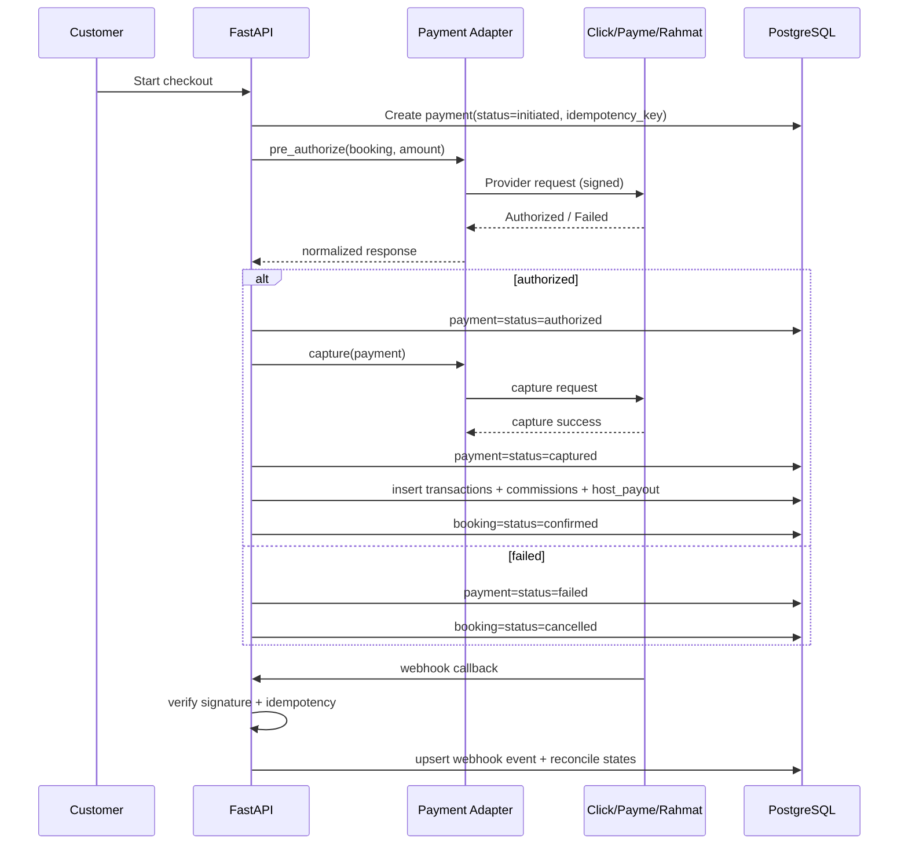

# Payment Flow Logic (Click / Payme / Rahmat Ready)

## 1. Payment State Machine

`initiated -> authorized -> captured`

`initiated/authorized -> failed`

`captured -> refund_pending -> refunded`

## 2. Commission Split Logic

Given:

- `gross = booking.total_amount`
- `platform_amount = gross * platform_rate`
- `host_amount = gross - platform_amount`

Stored in `commissions` table on successful capture.

## 3. Sequence Diagram

## 4. Callback/Webhook Rules

- verify provider signature before any state mutation
- store raw event in `payment_webhook_events`
- enforce unique `(provider, provider_event_id)` to prevent duplicate processing
- webhook handler must be idempotent and safe for retries

## 5. Refund Logic

1. Validate booking/payment refundable by policy and status.
2. Call provider refund endpoint.
3. Set payment state `refund_pending` then `refunded` on callback/success.
4. Insert `transactions(txn_type=refund)`.
5. Adjust commissions and host payout status (`reversed`/`failed` as applicable).
6. Update booking status according to cancellation policy.

## 6. Provider Adapter Contract

Each provider adapter implements:

- `pre_authorize(amount, currency, reference, metadata)`
- `capture(provider_payment_id, amount)`
- `refund(provider_payment_id, amount)`
- `verify_signature(headers, payload)`
- `normalize_status(provider_payload)`

This keeps core payment service independent of gateway specifics.

## 7. Compliance & Security Controls

- never store full PAN/card details in platform DB
- HMAC/signature verification for callbacks
- strict timeout + retry policy with exponential backoff
- audit log on every payment state transition
- least-privilege credentials per provider and environment
