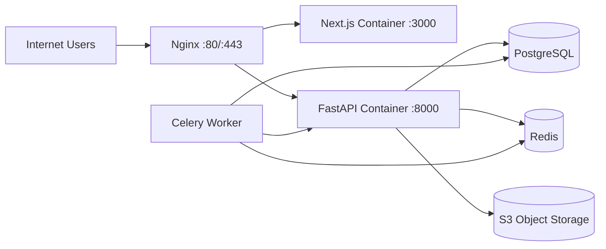

# Deployment Structure (Docker + Nginx + SSL + CI/CD)

## 1. Runtime Topology

## 2. Containers

- `nginx`: reverse proxy, TLS termination, static caching
- `frontend`: Next.js SSR app
- `backend`: FastAPI API service
- `worker`: Celery worker for async tasks
- `postgres`: primary relational datastore
- `redis`: lock/cache/broker
- `minio` (optional): local S3-compatible object storage

## 3. Environments

- `dev`: docker compose with local ports
- `staging`: production-like with real TLS domain
- `prod`: hardened images, managed backups, external DB/Redis recommended

## 4. SSL (Let's Encrypt)

- Nginx serves ACME challenge from `infra/certbot/www`
- Certbot renews certificates and reloads Nginx
- Force HTTP->HTTPS redirect after initial cert provisioning

## 5. CI/CD Pipeline (GitHub Actions)

1. Lint and test backend/frontend
2. Build Docker images
3. Security scan (dependencies + image scan)
4. Push images to registry
5. Deploy to target host/cluster
6. Run post-deploy health checks

## 6. Production Hardening Checklist

- set `SECURE_*` headers in Nginx
- use non-root user in containers
- isolate DB/Redis in private network
- enable point-in-time backups for PostgreSQL
- centralize logs and metrics
- configure WAF and bot protection
- rotate secrets regularly

## 7. Scaling Strategy

- scale `backend` and `frontend` horizontally
- scale `worker` independently by queue depth
- add PostgreSQL read replica for analytics/reporting
- move media to managed object storage + CDN
