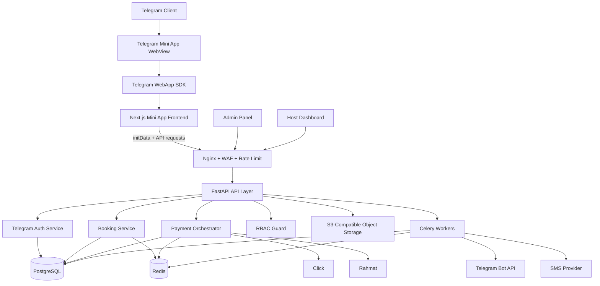
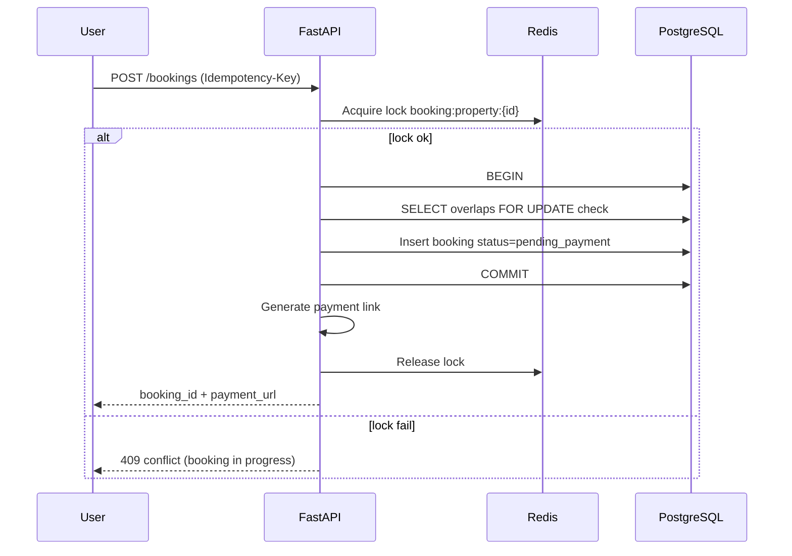
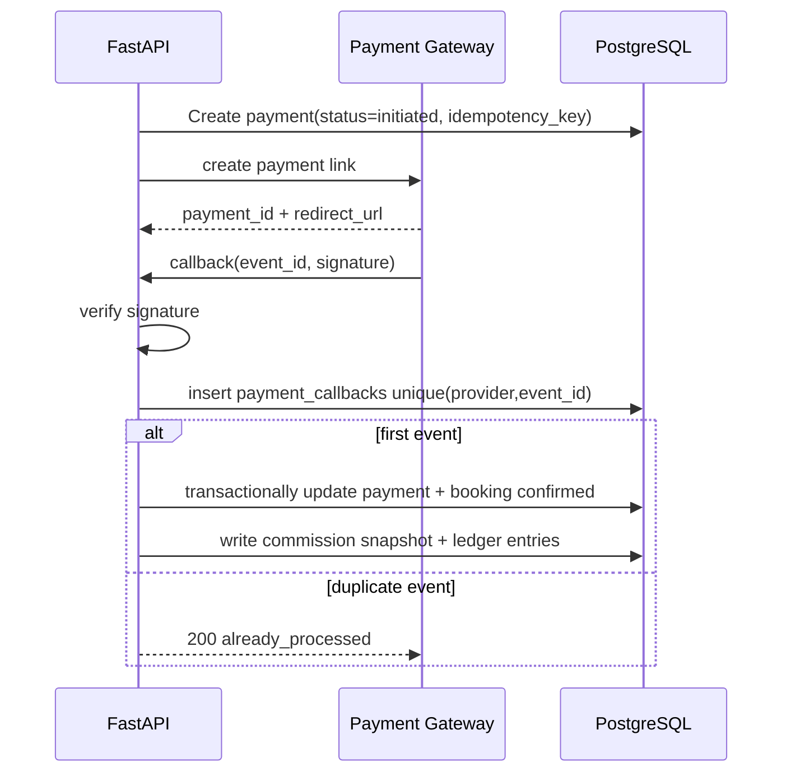
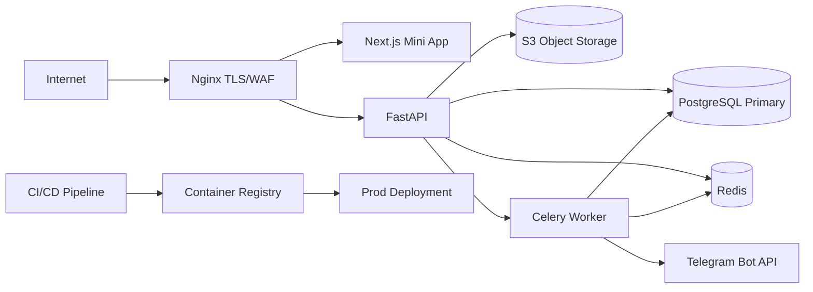

# Premium House - Telegram Mini App Production Architecture

## 1. Full System Architecture Diagram + Explanation



Runtime explanation:

1. Telegram user Mini Appni ochadi va `initData` oladi.
2. Frontend `initData`ni backendga yuboradi (`/auth/telegram`).
3. Backend hashni bot token bilan tekshiradi va replay attackdan himoya qiladi.
4. User `telegram_id` asosida upsert qilinadi, JWT access/refresh beriladi.
5. Booking/payout/payment operatsiyalari API + Redis lock + PostgreSQL transaction orqali bajariladi.
6. Callback va notificationlar asynchronous workerlarda qayta ishlanadi.

## 2. Complete DB Schema (Tables + Relations)

To'liq production SQL schema ushbu faylda:

- `docs/13-telegram-db-schema.sql`

Schema qamrovi:

1. Telegram-based users + refresh token rotation.
2. RBAC (`roles`, `permissions`, `user_roles`, `role_permissions`).
3. Properties, images, amenities, blocked dates, dynamic pricing.
4. Concurrency-safe bookings (`daterange` overlap protection).
5. Payments, transactions, refunds, callback dedup.
6. Commission snapshots, platform/host balances, ledger entries.
7. Reviews, notifications, audit trail.

## 3. Booking Concurrency-Safe Algorithm



Algorithm qoidalari:

1. Har booking `Idempotency-Key` bilan qabul qilinadi.
2. Redis lock key: `lock:property:{property_id}`.
3. DBda overlap tekshiruvi:
- `daterange(start_date, end_date, '[)')` bo'yicha exclusion constraint.
4. Booking `pending_payment` holatda yaratiladi va `expires_at` qo'yiladi.
5. Lock faqat booking statusi saqlangach bo'shatiladi.
6. Cron/Celery `expires_at < now()` bookinglarni `expired` ga o'tkazadi.

## 4. Telegram Auth Verification Code Logic

Ishchi kod fayli:

- `backend/app/services/telegram_auth_service.py`

Flow:

1. `initData` query-string parse qilinadi.
2. `hash` ajratib olinadi.
3. `auth_date` freshness tekshiriladi (`max_age_seconds`).
4. `data_check_string` sorted key-value formatda yig'iladi.
5. Secret key: `HMAC_SHA256("WebAppData", bot_token)`.
6. Expected hash: `HMAC_SHA256(secret_key, data_check_string)`.
7. `hmac.compare_digest` bilan taqqoslanadi.
8. Valid bo'lsa user payloaddan `telegram_id`, `first_name`, `last_name`, `username`, `photo_url` olinadi.

## 5. Payment Idempotent Flow



Idempotency qoidalari:

1. `payments.idempotency_key` unique index.
2. Callback dedupe: `payment_callbacks(provider, provider_event_id)` unique.
3. Booking update faqat allowed transitionlarda bajariladi.
4. Duplicate callback doim 200 qaytaradi.

## 6. Folder Structure

```text
PremiumHouse/
├── backend/
│   ├── app/
│   │   ├── api/v1/
│   │   ├── core/
│   │   ├── db/
│   │   ├── models/
│   │   ├── schemas/
│   │   ├── services/
│   │   │   ├── telegram_auth_service.py
│   │   │   ├── booking_service.py
│   │   │   └── payment_service.py
│   │   ├── tasks/
│   │   └── utils/
│   ├── alembic/versions/
│   └── tests/
├── frontend/
│   ├── app/
│   ├── components/
│   ├── lib/
│   │   └── telegram.ts
│   └── styles/
├── infra/
│   ├── docker-compose.yml
│   ├── nginx/
│   └── certbot/
└── docs/
```

## 7. Deployment Structure



Deploy talablari:

1. Stateless API/Frontend containerlar horizontal scale qilinadi.
2. PostgreSQL va Redis private networkda ishlaydi.
3. Nginx secure headers + rate limit + SSL termination.
4. Object storage/CDN media uchun alohida ishlatiladi.
5. CI/CD build, scan, migration, health-check bosqichlari bilan.

## 8. Background Job Architecture

Background queue `Celery + Redis`:

1. `expire_pending_bookings` (har 1 daqiqa).
2. `reconcile_payment_callbacks` (retry queue).
3. `send_booking_notifications` (Telegram/SMS).
4. `rebuild_property_rating_cache`.
5. `daily_balance_settlement_snapshot`.
6. `fraud_signal_scan` (rate/replay anomalies).

Ishlash modeli:

1. API event yozadi (`booking_events`/`payment_events`).
2. Celery task eventni oladi va idempotent qayta ishlaydi.
3. Natija audit logga yoziladi.
4. Xatoda exponential backoff retry qilinadi.

## 9. Balance & Commission Accounting Logic

Accounting model:

1. Booking vaqtida `platform_commission_snapshot` va `host_earning_snapshot` hisoblanadi.
2. Payment success bo'lsa double-entry ledger yoziladi:
- platform cash in
- host payable increase
3. Refund bo'lsa reverse ledger entry yoziladi.
4. `platform_balances` va `host_balances` jadvallari tezkor aggregation uchun saqlanadi.
5. Master source har doim `balance_ledger_entries`.

Commission formula:

- `commission_amount = total_price * commission_percent / 100`
- `host_earning = total_price - commission_amount`

Safety qoidalari:

1. Snapshot bookingga immutable saqlanadi.
2. Commission policy keyinchalik o'zgarsa ham eski bookinglarga ta'sir qilmaydi.
3. Har payoutdan oldin ledger reconciliation bajariladi.

## 10. API Structure (REST, Telegram Mini App)

Auth:

1. `POST /api/v1/auth/telegram`
2. `POST /api/v1/auth/refresh`
3. `POST /api/v1/auth/logout`

Properties:

1. `GET /api/v1/properties`
2. `GET /api/v1/properties/{id}`
3. `POST /api/v1/properties`
4. `PATCH /api/v1/properties/{id}`
5. `DELETE /api/v1/properties/{id}`

Booking:

1. `POST /api/v1/bookings`
2. `POST /api/v1/bookings/{id}/cancel`
3. `GET /api/v1/bookings/{id}`

Payments:

1. `POST /api/v1/payments/create-link`
2. `POST /api/v1/payments/callback/{provider}`
3. `POST /api/v1/payments/{id}/refund`

Review:

1. `POST /api/v1/reviews`
2. `POST /api/v1/reviews/{id}/reply`

Admin analytics:

1. `GET /api/v1/admin/analytics/summary`
2. `GET /api/v1/admin/analytics/revenue`
3. `GET /api/v1/admin/analytics/commissions`

Swagger security:

1. Productionda internal network yoki admin JWT bilan himoyalanadi.
2. Public environmentda `docs_url` cheklanadi.
